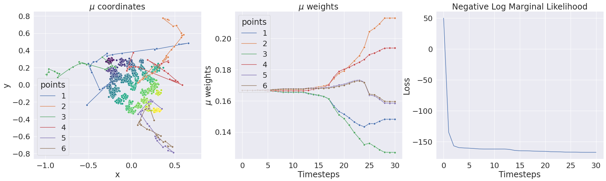
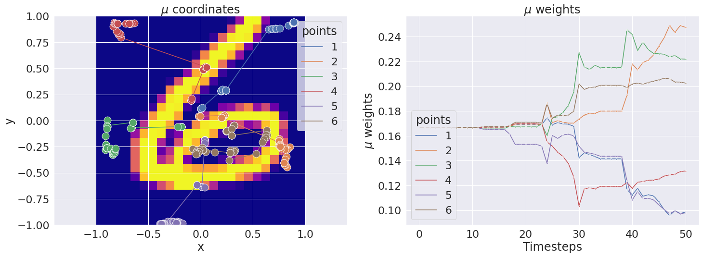
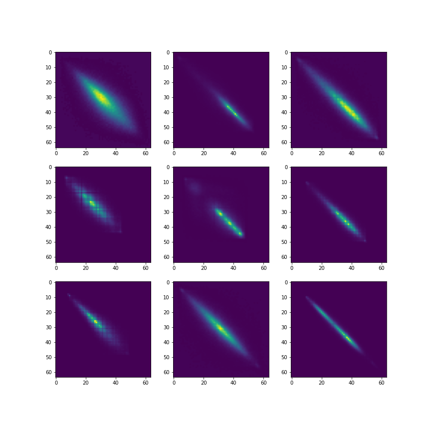

# Gaussian Processes on Distributions based on Regularized Optimal Transport
*François Bachoc, Louis Béthune, Alberto Gonzalez-Sanz, Jean-Michel Loubes.*

This repository contains the code for the paper: "Gaussian Processes on Distributions based on Regularized Optimal Transport" accepted at AISTATS 2023. Arxiv version: [https://arxiv.org/abs/2210.06574](https://arxiv.org/abs/2210.06574)

To cite us:

```
@inproceedings{bachoc2023gaussian,
      title={Gaussian Processes on Distributions based on Regularized Optimal Transport}, 
      author={François Bachoc and Louis Béthune and Alberto Gonzalez-Sanz and Jean-Michel Loubes},
      booktitle={AISTATS},
      year={2021}
}
```

## Warning

`gpjax` is a major dependency of the project. Unfortunately this library is still in alpha and went through some numerous breaking API changes during the reviewing of the paper. Hence, some notebooks may not run out of the box anymore (some of them work with `0.4.13` version, and others with `0.5.3` version). Maintaining the notebooks is beyond the scope of our project, where the objective was mainly to illustrate the theorems of the paper. In the future, a reference implementation of the kernel will be available, based on a stable API of `gpjax`.

## Dependencies

The work relies on Jax library. It requires:
  * ott-jax: a library for differentiable optimal transport based on Jax.
  * jaxopt: a library for differentiable optimization based on Jax (L-BFGS).
  * gpjax: a library for Gaussian processes based on Jax.
  * scikit-learn: for other implementations of Gaussian processes.
  * scikit-image: for image processing of Gray Level Co-occurence Matrices (GLCM).

The code has been tested on CPU/GPU in `float32` and `float64` precision.

## Notebooks

The following notebooks were used to generates figures of the paper:

  * `fig_1.ipynb`: illustration of the full algorithm on toy example from Bachoc et al. (2020).
  
  * `fig_2.ipynb`: same toy example as before with hardcoded reference measure to study its importance.
  * `fig_3_7.ipynb`: illustration of the full algorithm on Mnist/Fashion-Mnist examples. Different options allow to optimize only `x_i` or `w_i`, or both, using L-BFGS.
  
  * `fig_4_5.ipynb`: toy synthetic example with two 2D Gaussian mixture and uniform reference measure. Allow to better understand the role of dual variables.
  * `fig_10_11.ipynb`: C-SVM results on UIUC Texture dataset. In particular, we re-run C-SVM with RBF kernel and outperformed the results reported by Kolouri et al. (2016).
  
  * `fig_8_9.ipynb`: C-SVM results on Mnist dataset. Study influence of random afine transformation on the dual variables.
  * `tab_3.ipynb`: contains pre-computed reference measures on Mnist for different sizes of reference measures (using notebook `fig_3_7.ipynb`). Contain implementation of MMD kernel and code for benchmarks of Table 3.

## Legacy code

The following notebooks are not crucial for reproducibility but were used during research:

  * `fig_6.ipynb`: toy example of figures 1 and 2 with a 2, this time with scikit-learn Gaussian processes. The code is not optimized and is not meant to be used for large scale problems. Empirically the code of scikit-learn is less stable than the one of gpjax (different re-parametrization of feasible space). This shall not be used for hard problems.
  * `manual_gp_toy.ipynb`: manual re-implementation of a Gaussian process Regression. Does not use gpjax. This is not meant to be used for large scale problems. This illustrates the possibility to re-implement manually the Gaussian process regression in Jax to explicit the form of the likelihood. Was primarly used for sanity checks, early tests, and present here for exhaustivity.
